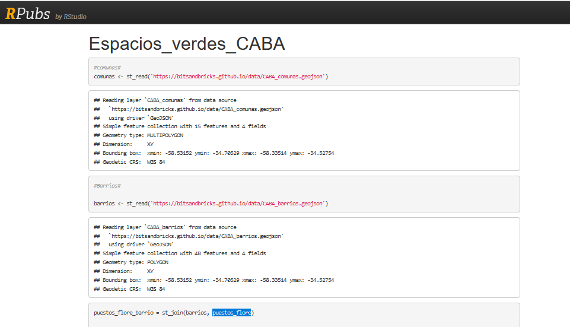
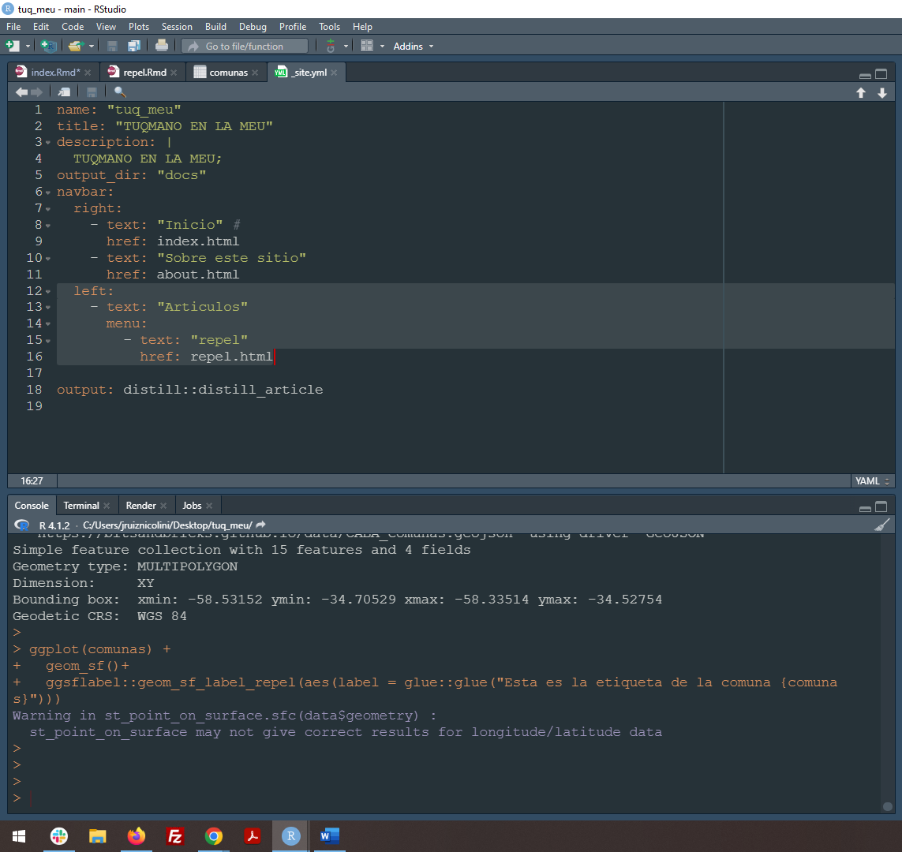

```{r setup, include=FALSE}
knitr::opts_chunk$set(echo = FALSE)

# Learn more about creating websites with Distill at:
# https://rstudio.github.io/distill/website.html

# Learn more about publishing to GitHub Pages at:
# https://rstudio.github.io/distill/publish_website.html#github-pages

```

# Contenido de esta sitio 

## Paso a paso para crear un sitio con {distill} 

Ver en menú: _Articulos/distill_

## Ejemplo de código para mapa interactivo

**(Fuente: Sixto <https://rpubs.com/Sixto233/936423>)**

Voy a levantar los datos de geometrías dispoibilizados por Tonio VB.

```{r, echo=TRUE, warning=FALSE, message=FALSE}
library(sf)

#Descargo geometry de comunas de CABA
comunas <- st_read('https://bitsandbricks.github.io/data/CABA_comunas.geojson')

#Barrios#

barrios <- st_read('https://bitsandbricks.github.io/data/CABA_barrios.geojson')
```

# HOUSTON...

Tenemos un problema para reproducir el ejemplo, dado que en el RPub no tengo referencia de donde levantar la info sobre florerías para el análisis. Cortamos acá el ejemplo.




# ARTICULOS EN ESTA WEB

* Pueden notar que generamos un menú en la barra de navegación dónde se listan artículos

* Cada artículo es un .Rmd independiente

* Los artículos están listados dentro del archivo _site.yml anidados dentro de la barra de navegación 


